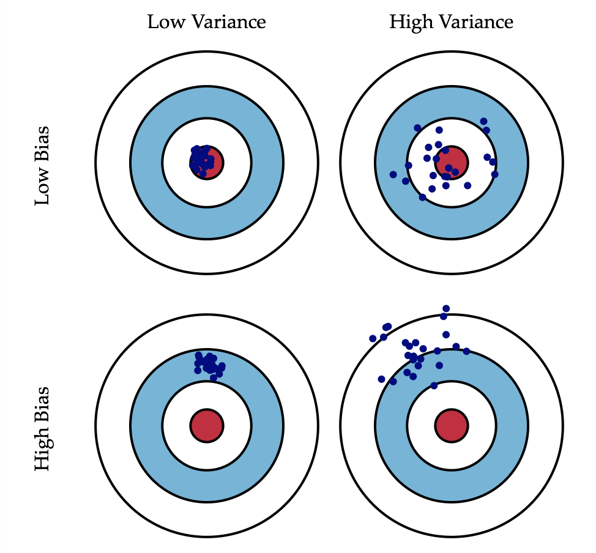
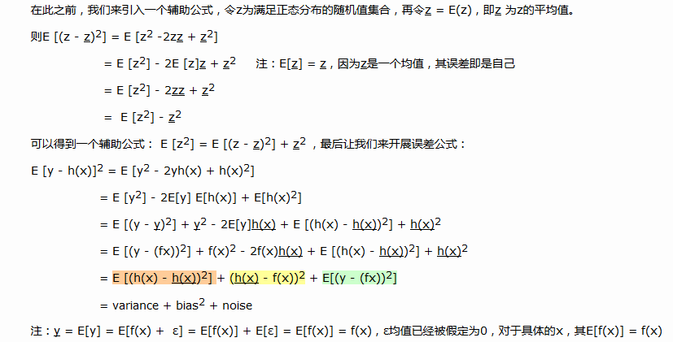
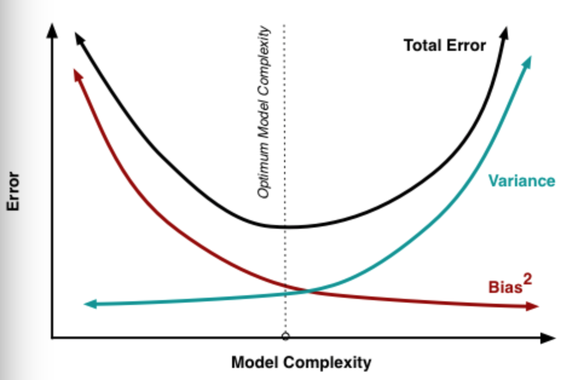
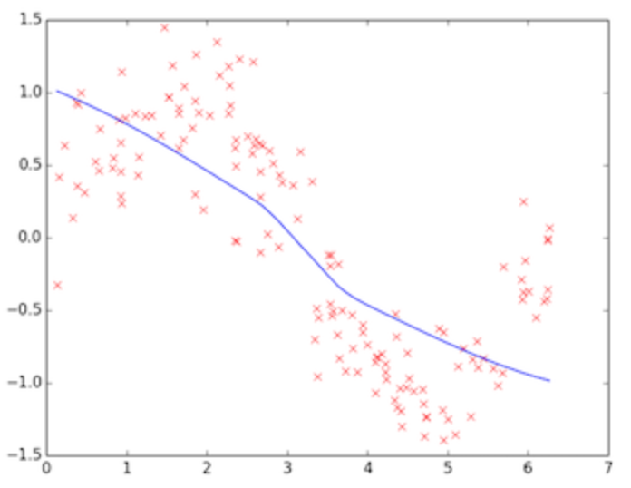
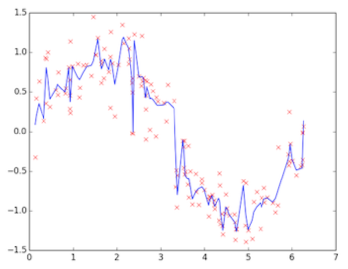
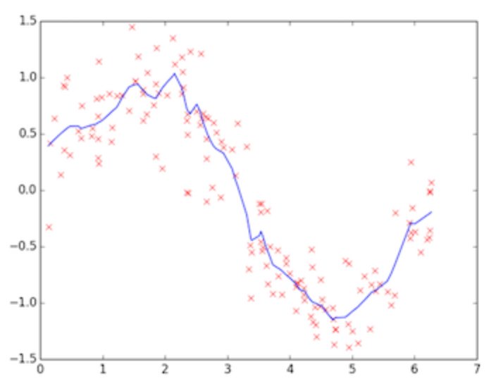

## 偏差和方差

　　当我们费劲周章不断调参来训练模型时，不可避免地会思考一系列问题，模型好坏的评判标准是什么？改善模型的依据何在？何时停止训练为佳？

　　要解决上述问题，我们需要引入偏差和方差这两个概念，理解他们很重要，也是后续了解过拟合、正则化、提早终止训练、数据增强等概念和方法的前提。

 
### 一、概念定义

   * 偏差（bias）：偏差衡量了模型的预测值与实际值之间的偏离关系。通常在深度学习中，我们每一次训练迭代出来的新模型，都会拿训练数据进行预测，偏差就反应在预测值与实际值匹配度上，比如通常在keras运行中看到的准确度为96%，则说明是低偏差；反之，如果准确度只有70%，则说明是高偏差。
   * 方差（variance）：方差描述的是训练数据在不同迭代阶段的训练模型中，预测值的变化波动情况（或称之为离散情况）。从数学角度看，可以理解为每个预测值与预测均值差的平方和的再求平均数。通常在深度学习训练中，初始阶段模型复杂度不高，为低方差；随着训练量加大，模型逐步拟合训练数据，复杂度开始变高，此时方差会逐渐变高。
   
### 二、图形定义

这是一张常见的靶心图。可以想象红色靶心表示为实际值，蓝色点集为预测值。在模型不断地训练迭代过程中，我们能碰到四种情况：

* 低偏差，低方差：这是训练的理想模型，此时蓝色点集基本落在靶心范围内，且数据离散程度小，基本在靶心范围内；
* 低偏差，高方差：这是深度学习面临的最大问题，过拟合了。也就是模型太贴合训练数据了，导致其泛化（或通用）能力差，若遇到测试集，则准确度下降的厉害；
* 高偏差，低方差：这往往是训练的初始阶段；
* 高偏差，高方差：这是训练最糟糕的情况，准确度差，数据的离散程度也差。

### 三、数学定义

　　我们从简单的回归模型来入手，对于训练数据集S = {(xi , yi)}，令yi = f(xi) + ε，假设为实际方程，其中ε是满足正态分布均值为0，标准差为σ的值。

　　我们再假设预测方程为h(x) = wx + b，这时我们希望总误差Err(x) = ∑i [yi - h(xi)]2 能达到最小值。给定某集合样本（x, y），我们可以展开误差公式，以生成用方差、偏差和噪音组合的方式。

　　

　　由此可见，误差 ＝ 方差 ＋ 偏差2 + 噪音 组成，一般来说，随着模型复杂度的增加，方差会逐渐增大，偏差会逐渐减小，见下图：
  
  
 ### 四、过拟合、欠拟合和恰好

　　偏差的变化趋势相信大家都容易理解，随着模型的不断训练，准确度不断上升，自然偏差逐渐降低。但方差的变化趋势却不易理解，为何训练初始阶段是低方差，训练后期易是高方差？

　　注意方差的数学公式为：E [(h(x) - h(x))2] ，也就是说为每个预测值与预测均值差的平方和再求平均数，可以表现为一种波动变化，低方差意味低变化，高方差意味高变化。那我们可以通过训练的不同阶段来直观感受方差的变化：
   
   
  上图为训练初始阶段，我们的模型（蓝线）对训练数据（红点）拟合度很差，是高偏差，但蓝线近似线性组合，其波动变化小，套用数学公式也可知数值较小，故为低方差，这个阶段也称之为欠拟合（underfitting），需要加大训练迭代数。
   
  
  上图为训练的后期阶段，可明显看出模型的拟合度很好，是低偏差，但蓝线的波动性非常大，为高方差，这个阶段称之为过拟合（overfitting），问题很明显，蓝线模型很适合这套训练数据，但如果用测试数据来检验模型，就会发现泛化能力差，准确度下降。

　　因此我们需要两者之间的一个模型。
  
  
  上图这个蓝色模型可认为是“恰好”的一个模型，既能跟训练数据拟合，又离完美拟合保持一定距离，模型更具通用性，用测试数据验证会发现准确度也不错。

　　这个模型怎么来呢？我们可以采取很多手段，比如：

   加大数据量，数据越多，自然其泛化能力也越强。但现实情况我们不能像大公司那样拥有很多资源，那怎么办？一种可行的办法就是根据已有的数据做数据增强，比如旋转、反转、白增强等操作造出很多数据；
   正则化（regularization，个人感觉中文翻译未能表达英文原义，应该是表达约束、调整的意思），通常来说有dropout、L2、L1等正则化手段；
   提早结束训练，防止训练过拟合化。

  
