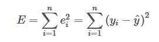
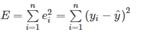
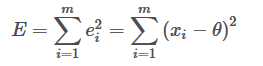
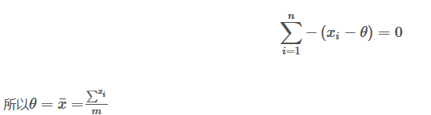
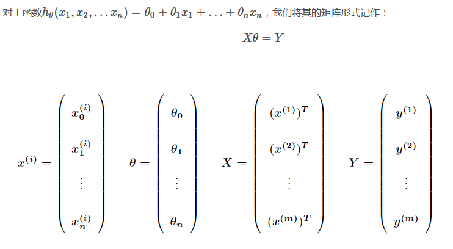
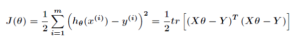
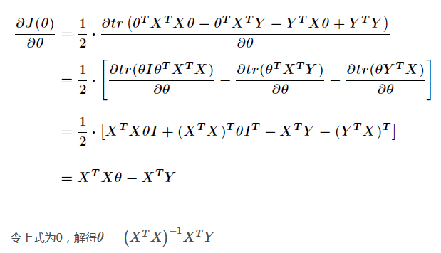

# 最小二乘法
    
## 1.1 前言
   最小二乘法（又称最小平方法）是一种数学优化技术。它通过最小化误差的平方和寻找数据的最佳函数匹配。利用最小二乘法可以简便地求得未知的数据，并使得这些求得的数据与实际数据之间误差的平方和为最小。最小二乘法还可用于曲线拟合。其他一些优化问题也可通过最小化能量或最大化熵用最小二乘法来表达。
## 2 核心思想

   最小二乘法是勒让德( A. M. Legendre)于1805年在其著作《计算慧星轨道的新方法》中提出的。它的主要思想就是求解未知参数，使得理论值与观测值之差（即误差，或者说残差）的平方和达到最小：
   
   

   观测值yi就是我们的多组样本，理论值y^就是我们的假设拟合函数。目标函数也就是在机器学习中常说的损失函数E，我们的目标是得到使目标函数最小化时候的参数。
   
## 2.1核心思想对任意函数f的通用解法

   * 1.列出损失函数 

   * 2.根据损失函数对参数应用多元函数的求极值方法，直接求解函数最小值。而更常见的方法即是将损失函数yi用xi和参数表示，然后使用梯度下降算法。
   * 3.求得函数最小值的参数或待到梯度算法收敛，此时的参数即为所求
    这些个步骤说起来抽象，实际上这是在机器学习中应用最广泛的方法。但是对于后面的线性回归问题，有着更简洁的推导方法。
    
## 2.2 以算术平均值为例——为什么算术平均即是真值

   可以说整部数理统计学的历史，就是对算术平均不断深入研究的历史。而最小二乘法可以解释为什么多次测量取算术平均的结果就是真值，比如估计身高可以测三次后取平均。
   当我们对于某个未知量θ观测m次，记每次的结果为xi
     
   
   求导得
   
   
   
## 2.3使用最小二乘求解线性回归问题

对于线性回归问题，当然可以使用求导的代数方法来找到损失函数的最小值。但矩阵法比代数法要简洁，所以现在很多书和机器学习库都是用的矩阵法来做最小二乘法，本文这里介绍一下如何使用矩阵法求解线性回归问题。
 
 
 故损失函数根据定义将Y用X和θ代替：
  
 应用矩阵迹的计算公式：
  
