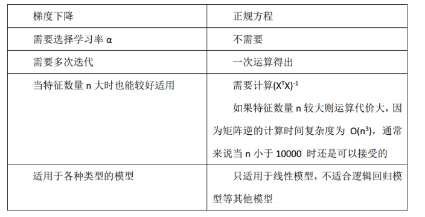
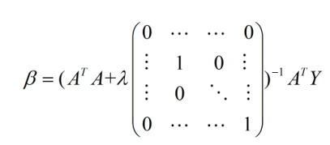

# 最小二乘法
    
## 1.1 前言
   最小二乘法（又称最小平方法）是一种数学优化技术。它通过最小化误差的平方和寻找数据的最佳函数匹配。利用最小二乘法可以简便地求得未知的数据，并使得这些求得的数据与实际数据之间误差的平方和为最小。最小二乘法还可用于曲线拟合。其他一些优化问题也可通过最小化能量或最大化熵用最小二乘法来表达。
## 2 核心思想

   最小二乘法是勒让德( A. M. Legendre)于1805年在其著作《计算慧星轨道的新方法》中提出的。它的主要思想就是求解未知参数，使得理论值与观测值之差（即误差，或者说残差）的平方和达到最小：
   
   

   观测值yi就是我们的多组样本，理论值y^就是我们的假设拟合函数。目标函数也就是在机器学习中常说的损失函数E，我们的目标是得到使目标函数最小化时候的参数。
   
## 2.1核心思想对任意函数f的通用解法

   * 1.列出损失函数 

   * 2.根据损失函数对参数应用多元函数的求极值方法，直接求解函数最小值。而更常见的方法即是将损失函数yi用xi和参数表示，然后使用梯度下降算法。
   * 3.求得函数最小值的参数或待到梯度算法收敛，此时的参数即为所求
    这些个步骤说起来抽象，实际上这是在机器学习中应用最广泛的方法。但是对于后面的线性回归问题，有着更简洁的推导方法。
    
## 2.2 以算术平均值为例——为什么算术平均即是真值

   可以说整部数理统计学的历史，就是对算术平均不断深入研究的历史。而最小二乘法可以解释为什么多次测量取算术平均的结果就是真值，比如估计身高可以测三次后取平均。
   当我们对于某个未知量θ观测m次，记每次的结果为xi
     
   
   求导得
   
   
   
## 2.3使用最小二乘求解线性回归问题

对于线性回归问题，当然可以使用求导的代数方法来找到损失函数的最小值。但矩阵法比代数法要简洁，所以现在很多书和机器学习库都是用的矩阵法来做最小二乘法，本文这里介绍一下如何使用矩阵法求解线性回归问题。
 
 
 故损失函数根据定义将Y用X和θ代替：
 
 
  
 应用矩阵迹的计算公式：
 
 
  
 Note：矩阵求导坑多，使用迹来计算比较方便。
 
## 3. 最小二乘法的适用场景

   前面已经提到，根据方程数m和特征数n可以判定方程组解的存在性问题和个数问题。
   * 当样本量m很少，小于特征数n的时候，这时拟合方程是欠定的，需要使用LASSO。
   * 当m=n时，用方程组求解。
   * 当m>n时，拟合方程是超定的，我们可以使用最小二乘法。
   
   局限性
   
   * 首先，最小二乘法需要计算逆矩阵，有可能逆矩阵不存在，这样就没有办法直接用最小二乘法。
   * 第二，当样本特征n非常的大的时候，计算逆矩阵是一个非常耗时的工作，甚至不可行。建议不超过10000个特征。
   * 第三，如果拟合函数不是线性的，这时无法使用最小二乘法，需要通过一些技巧转化为线性才能使用。（非线性最小二乘）
   
## 4.其他一些想法

### 4.1. 最小二乘法和梯度下降

  乍一看看β的最终结果，感觉很面熟，仔细一看，这不就是NG的ML课程中所讲到的正规方程嘛！实际上，NG所说的的正规方程的解法就是最小二乘法求解析解的解法。

  * (1)最小二乘法和梯度下降法在线性回归问题中的目标函数是一样的(或者说本质相同)，都是通过最小化均方误差来构建拟合曲线。

  * (2)二者的不同点可见下图(正规方程就是最小二乘法)：

　　　　　　　　　　　

   需要注意的一点是最小二乘法只适用于线性模型(这里一般指线性回归)；而梯度下降适用性极强，一般而言，只要是凸函数，都可以通过梯度下降法得到全局最优值(对于非凸函数，能够得到局部最优解)。

梯度下降法只要保证目标函数存在一阶连续偏导，就可以使用。

### 4.2. 最小二乘法的一些限制和解决方法：

我们由第三部分(2)式可知道，要保证最小二乘法有解，就得保证ATA是一个可逆阵(非奇异矩阵)；那如果不可逆怎么办？什么情况下不可逆？

关于ATA在什么情况下不可逆：

* (1)当样本的数量小于参数向量(即β)的维度时，此时ATA一定是不可逆的。例如：你有1000个特征，但你的样本数目小于1000的话，那么构造出的ATA就是不可逆的。

* (2)在所有特征中若存在一个特征与另一个特征线性相关或一个特征与若干个特征线性相关时，此时ATA也是不可逆的。为什么呢？

具体来说假设,A是m*n维的矩阵，若存在线性相关的特征，则R(A)<n,R(AT)<n,R(ATA)<n,所以ATA不可逆。

如果ATA不可逆，应该怎样解决？

* (1)筛选出线性无关的特征，不保留相同的特征，保证不存在线性相关的特征。

* (2)增加样本量。

* (3)采用正则化的方法。对于正则化的方法，常见的是L1正则项和L2正则项，L1项有助于从很多特征中筛选出重要的特征，而使得不重要的特征为0(所以L1正则项是个不错的特征选择方法)；如果采用L2正则项的话，实际上解析解就变成了如下的形式：

 
　　　　　　　　　　　　　　　　　　　　

λ即正则参数(是一种超参数)后面的矩阵为(n+1)*(n+1)维，如果不考虑常数项的话，就是一个单位阵；此时括号中的矩阵一定是可逆的。

### 4.3. 最小二乘法的改进

最小二乘法由于是最小化均方差，所以它考虑了每个样本的贡献，也就是每个样本具有相同的权重；由于它采用距离作为度量，使得他对噪声比较敏感(最小二乘法假设噪声服从高斯分布)，即使得他它对异常点比较敏感。因此，人们提出了加权最小二乘法，

相当于给每个样本设置了一个权重，以此来反应样本的重要程度或者对解的影响程度。
